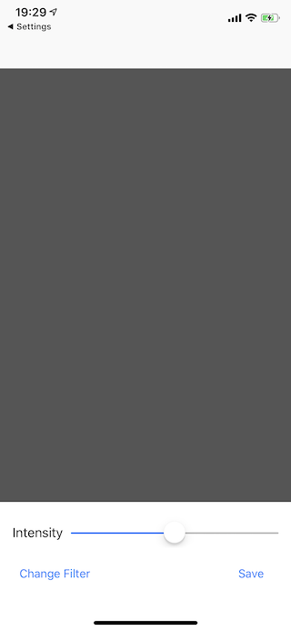
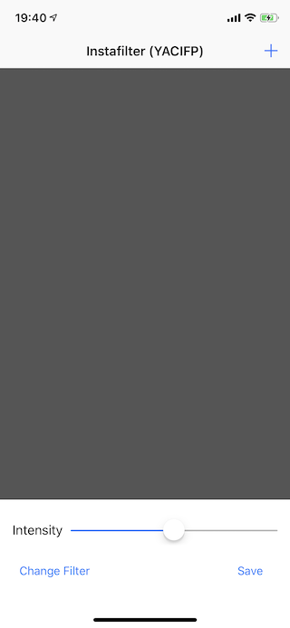
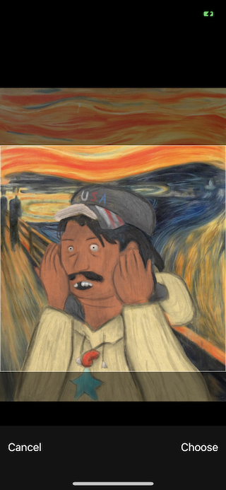
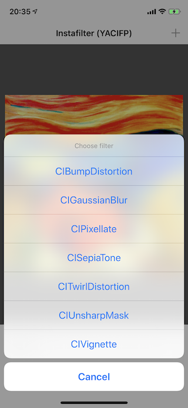
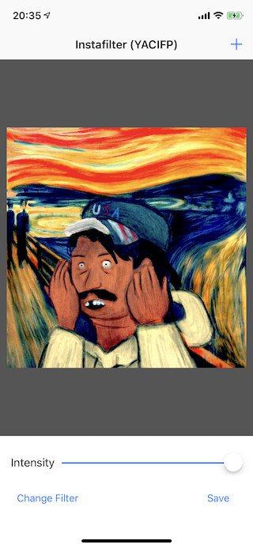
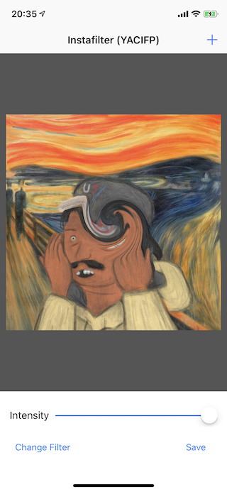
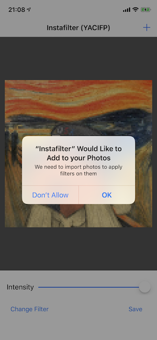
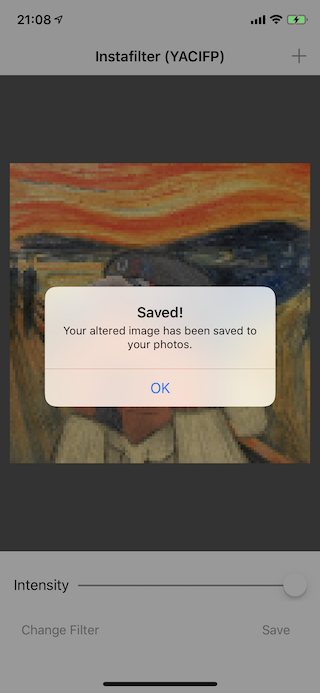
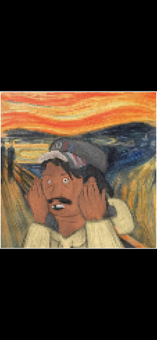

# Instafilter

## Description
Make a photo manipulation program using Core Image filters and a UISlider.

## Demo
### feature/designing-the-interface
| Screenshot 01 |
| ------------- |
|  |

### feature/importing-a-picture
| Screenshot 02 | Screenshot 03 |
| ------------- | ------------- |
|  |  |

### feature/applying-filters
| Screenshot 04 | Screenshot 05 | Screenshot 06 |
| ------------- | ------------- | ------------- |
|  |  |  |

### feature/saving-to-the-photo-library
| Screenshot 07 | Screenshot 08 | Screenshot 09 |
| ------------- | ------------- | ------------- |
|  |  |  |